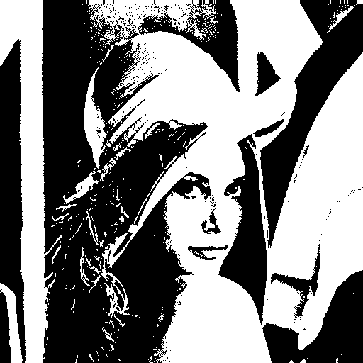

<h1>Redução de Dimensionalidade em Imagens para Redes Neurais</h1>


<h4>Repositório criado para o desafio do bootcamp BairesDev - Machine Learning Practitioner</h4>

<h3>Conversão de Imagem para Tons de Cinza e Binarização</h3>

<p align="justify">
    Este projeto implementa um algoritmo para converter uma imagem colorida em tons de cinza e em uma versão binarizada (preto e branco), utilizando Python. O código foi projetado para funcionar sem a dependência de bibliotecas avançadas como OpenCV, mas utiliza o **Pillow** (biblioteca padrão para manipulação de imagens).
</p>

<h2>Funcionalidades</h2>
<ol>
    <b><li>Conversão para Tons de Cinza:</b> Transforma uma imagem colorida para uma escala de cinza (valores entre 0 e 255) utilizando uma fórmula perceptual.
    <b><li>Binarização:</b> Aplica um algoritmo de limiarização para transformar a imagem em preto e branco (valores de 0 ou 255).
</ol>

<h2>Pré-requisitos</h2>

<p>Antes de executar o projeto, você precisará:</p>
<ul>
    <li>Python 3.8 ou superior.
    <li>A biblioteca Pillow instalada. Caso não tenha, instale com o comando: <code>pip install pillow</code>
</ul> 

<h2>Como Usar</h2>
<ol>
    <li>Clone este repositório ou baixe os arquivos diretamente.
    <li>Coloque a imagem que deseja processar no mesmo diretório do script ou forneça o caminho completo para ela.
    <li>No arquivo main.py, substitua o valor de image_path pelo caminho da sua imagem:
</ol>

```python
    image_path = "img/sua_imagem.jpg"
```
<p>Após isso, execute o script:</p>

```bash
    python main.py
```
<h3>Resultado</h3>
<p>O script processará a imagem e salvará dois arquivos no mesmo diretório do arquivo <code>main.py</code>:</p>
<ul>
    <li><b>grayscale_image.png:</b> A versão em tons de cinza.
    <li><b>binary_image.png:</b> A versão binarizada.
</ul>

<h2>Estrutura do Projeto</h2>

```bash    .
    ├── img/                  # Pasta para armazenar imagens de entrada
    │   └── sua_imagem.jpg    # (Exemplo) Imagem de entrada
    ├── main.py               # Código principal do projeto
    ├── grayscale_image.png   # Saída: Imagem em tons de cinza
    ├── binary_image.png      # Saída: Imagem binarizada
    └── README.md             # Este arquivo
```

<h2>Detalhes Técnicos</h2>
<h3>Fórmula para Conversão de Cinza</h3>
<p>Utilizamos a fórmula perceptual padrão para calcular o tom de cinza:</p>

```python
    Gray = 0.299 * R + 0.587 * G + 0.114 * B
```
<h3>Binarização</h3>
<p>Usamos um threshold (limiar) para decidir se o pixel será preto ou branco. O valor padrão é 127:</p>
<ul>
    <li>Pixel > 127: Branco (255)
    <li>Pixel ≤ 127: Preto (0)
</ul>

<h2>Resultado obtido</h2>
<table>
        <thead>
            <tr>
                <th>Imagem Original</th>
                <th>Imagem em Tons de Cinza</th>
                <th>Imagem Binarizada</th>
            </tr>
        </thead>
        <tbody>
            <tr>
                <td></td>
                <td></td>
                <td></td>
            </tr>
        </tbody>
    </table>